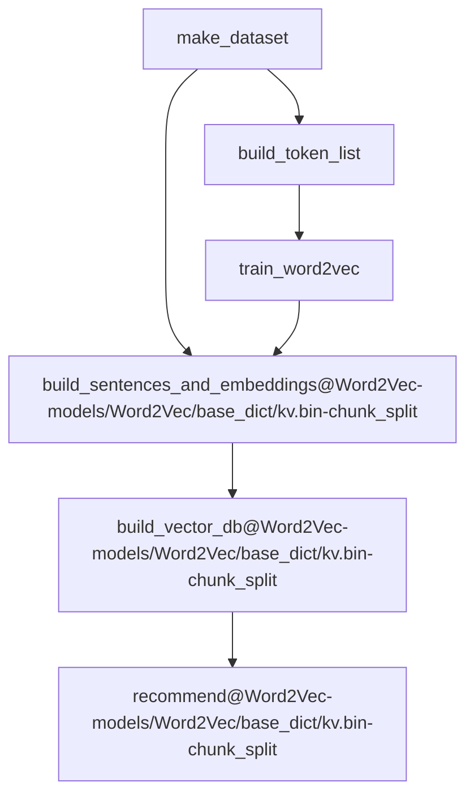

```mermaid
flowchart TD
	node1["build_sentences_and_embeddings@Word2Vec-models/Word2Vec/base_dict/kv.bin-chunk_split"]
	node2["build_token_list"]
	node3["build_vector_db@Word2Vec-models/Word2Vec/base_dict/kv.bin-chunk_split"]
	node4["make_dataset"]
	node5["recommend@Word2Vec-models/Word2Vec/base_dict/kv.bin-chunk_split"]
	node6["train_word2vec"]
	node1-->node3
	node2-->node6
	node3-->node5
	node4-->node1
	node4-->node2
	node6-->node1
```
