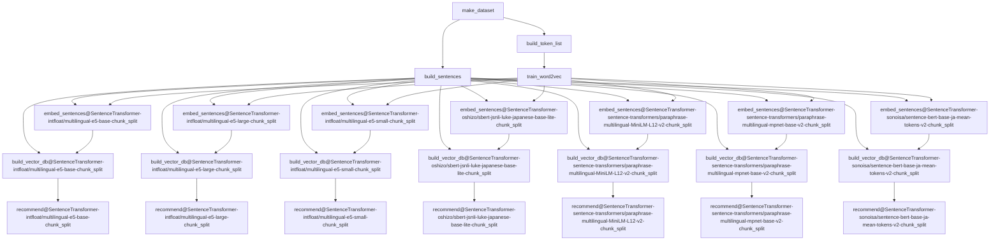

```mermaid
flowchart TD
	node1["build_sentences"]
	node2["build_token_list"]
	node3["build_vector_db@SentenceTransformer-intfloat/multilingual-e5-base-chunk_split"]
	node4["build_vector_db@SentenceTransformer-intfloat/multilingual-e5-large-chunk_split"]
	node5["build_vector_db@SentenceTransformer-intfloat/multilingual-e5-small-chunk_split"]
	node6["build_vector_db@SentenceTransformer-oshizo/sbert-jsnli-luke-japanese-base-lite-chunk_split"]
	node7["build_vector_db@SentenceTransformer-sentence-transformers/paraphrase-multilingual-MiniLM-L12-v2-chunk_split"]
	node8["build_vector_db@SentenceTransformer-sentence-transformers/paraphrase-multilingual-mpnet-base-v2-chunk_split"]
	node9["build_vector_db@SentenceTransformer-sonoisa/sentence-bert-base-ja-mean-tokens-v2-chunk_split"]
	node10["embed_sentences@SentenceTransformer-intfloat/multilingual-e5-base-chunk_split"]
	node11["embed_sentences@SentenceTransformer-intfloat/multilingual-e5-large-chunk_split"]
	node12["embed_sentences@SentenceTransformer-intfloat/multilingual-e5-small-chunk_split"]
	node13["embed_sentences@SentenceTransformer-oshizo/sbert-jsnli-luke-japanese-base-lite-chunk_split"]
	node14["embed_sentences@SentenceTransformer-sentence-transformers/paraphrase-multilingual-MiniLM-L12-v2-chunk_split"]
	node15["embed_sentences@SentenceTransformer-sentence-transformers/paraphrase-multilingual-mpnet-base-v2-chunk_split"]
	node16["embed_sentences@SentenceTransformer-sonoisa/sentence-bert-base-ja-mean-tokens-v2-chunk_split"]
	node17["make_dataset"]
	node18["recommend@SentenceTransformer-intfloat/multilingual-e5-base-chunk_split"]
	node19["recommend@SentenceTransformer-intfloat/multilingual-e5-large-chunk_split"]
	node20["recommend@SentenceTransformer-intfloat/multilingual-e5-small-chunk_split"]
	node21["recommend@SentenceTransformer-oshizo/sbert-jsnli-luke-japanese-base-lite-chunk_split"]
	node22["recommend@SentenceTransformer-sentence-transformers/paraphrase-multilingual-MiniLM-L12-v2-chunk_split"]
	node23["recommend@SentenceTransformer-sentence-transformers/paraphrase-multilingual-mpnet-base-v2-chunk_split"]
	node24["recommend@SentenceTransformer-sonoisa/sentence-bert-base-ja-mean-tokens-v2-chunk_split"]
	node25["train_word2vec"]
	node1-->node3
	node1-->node4
	node1-->node5
	node1-->node6
	node1-->node7
	node1-->node8
	node1-->node9
	node1-->node10
	node1-->node11
	node1-->node12
	node1-->node13
	node1-->node14
	node1-->node15
	node1-->node16
	node2-->node25
	node3-->node18
	node4-->node19
	node5-->node20
	node6-->node21
	node7-->node22
	node8-->node23
	node9-->node24
	node10-->node3
	node11-->node4
	node12-->node5
	node13-->node6
	node14-->node7
	node15-->node8
	node16-->node9
	node17-->node1
	node17-->node2
	node25-->node10
	node25-->node11
	node25-->node12
	node25-->node13
	node25-->node14
	node25-->node15
	node25-->node16
```
