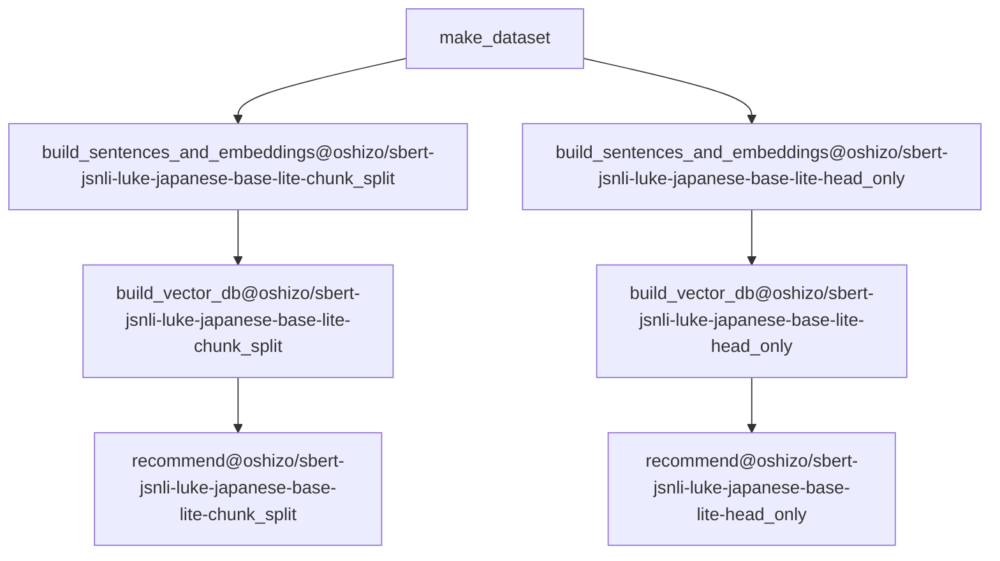

```mermaid
flowchart TD
	node1["build_sentences_and_embeddings@oshizo/sbert-jsnli-luke-japanese-base-lite-chunk_split"]
	node2["build_sentences_and_embeddings@oshizo/sbert-jsnli-luke-japanese-base-lite-head_only"]
	node3["build_vector_db@oshizo/sbert-jsnli-luke-japanese-base-lite-chunk_split"]
	node4["build_vector_db@oshizo/sbert-jsnli-luke-japanese-base-lite-head_only"]
	node5["make_dataset"]
	node6["recommend@oshizo/sbert-jsnli-luke-japanese-base-lite-chunk_split"]
	node7["recommend@oshizo/sbert-jsnli-luke-japanese-base-lite-head_only"]
	node1-->node3
	node2-->node4
	node3-->node6
	node4-->node7
	node5-->node1
	node5-->node2
```
