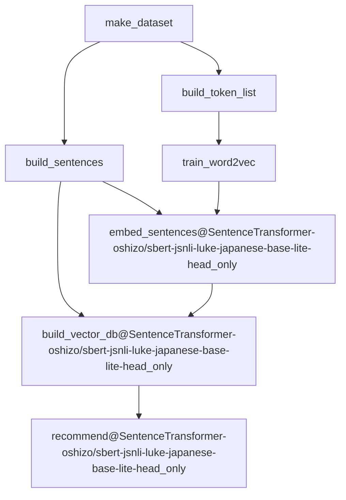

```mermaid
flowchart TD
	node1["build_sentences"]
	node2["build_token_list"]
	node3["build_vector_db@SentenceTransformer-oshizo/sbert-jsnli-luke-japanese-base-lite-head_only"]
	node4["embed_sentences@SentenceTransformer-oshizo/sbert-jsnli-luke-japanese-base-lite-head_only"]
	node5["make_dataset"]
	node6["recommend@SentenceTransformer-oshizo/sbert-jsnli-luke-japanese-base-lite-head_only"]
	node7["train_word2vec"]
	node1-->node3
	node1-->node4
	node2-->node7
	node3-->node6
	node4-->node3
	node5-->node1
	node5-->node2
	node7-->node4
```
