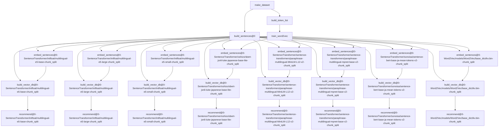

```mermaid
flowchart TD
	node1["build_sentences@0"]
	node2["build_token_list"]
	node3["build_vector_db@0-SentenceTransformer/intfloat/multilingual-e5-base-chunk_split"]
	node4["build_vector_db@0-SentenceTransformer/intfloat/multilingual-e5-large-chunk_split"]
	node5["build_vector_db@0-SentenceTransformer/intfloat/multilingual-e5-small-chunk_split"]
	node6["build_vector_db@0-SentenceTransformer/oshizo/sbert-jsnli-luke-japanese-base-lite-chunk_split"]
	node7["build_vector_db@0-SentenceTransformer/sentence-transformers/paraphrase-multilingual-MiniLM-L12-v2-chunk_split"]
	node8["build_vector_db@0-SentenceTransformer/sentence-transformers/paraphrase-multilingual-mpnet-base-v2-chunk_split"]
	node9["build_vector_db@0-SentenceTransformer/sonoisa/sentence-bert-base-ja-mean-tokens-v2-chunk_split"]
	node10["build_vector_db@0-Word2Vec/models/Word2Vec/base_dict/kv.bin-chunk_split"]
	node11["embed_sentences@0-SentenceTransformer/intfloat/multilingual-e5-base-chunk_split"]
	node12["embed_sentences@0-SentenceTransformer/intfloat/multilingual-e5-large-chunk_split"]
	node13["embed_sentences@0-SentenceTransformer/intfloat/multilingual-e5-small-chunk_split"]
	node14["embed_sentences@0-SentenceTransformer/oshizo/sbert-jsnli-luke-japanese-base-lite-chunk_split"]
	node15["embed_sentences@0-SentenceTransformer/sentence-transformers/paraphrase-multilingual-MiniLM-L12-v2-chunk_split"]
	node16["embed_sentences@0-SentenceTransformer/sentence-transformers/paraphrase-multilingual-mpnet-base-v2-chunk_split"]
	node17["embed_sentences@0-SentenceTransformer/sonoisa/sentence-bert-base-ja-mean-tokens-v2-chunk_split"]
	node18["embed_sentences@0-Word2Vec/models/Word2Vec/base_dict/kv.bin-chunk_split"]
	node19["make_dataset"]
	node20["recommend@0-SentenceTransformer/intfloat/multilingual-e5-base-chunk_split"]
	node21["recommend@0-SentenceTransformer/intfloat/multilingual-e5-large-chunk_split"]
	node22["recommend@0-SentenceTransformer/intfloat/multilingual-e5-small-chunk_split"]
	node23["recommend@0-SentenceTransformer/oshizo/sbert-jsnli-luke-japanese-base-lite-chunk_split"]
	node24["recommend@0-SentenceTransformer/sentence-transformers/paraphrase-multilingual-MiniLM-L12-v2-chunk_split"]
	node25["recommend@0-SentenceTransformer/sentence-transformers/paraphrase-multilingual-mpnet-base-v2-chunk_split"]
	node26["recommend@0-SentenceTransformer/sonoisa/sentence-bert-base-ja-mean-tokens-v2-chunk_split"]
	node27["recommend@0-Word2Vec/models/Word2Vec/base_dict/kv.bin-chunk_split"]
	node28["train_word2vec"]
	node1-->node3
	node1-->node4
	node1-->node5
	node1-->node6
	node1-->node7
	node1-->node8
	node1-->node9
	node1-->node10
	node1-->node11
	node1-->node12
	node1-->node13
	node1-->node14
	node1-->node15
	node1-->node16
	node1-->node17
	node1-->node18
	node2-->node28
	node3-->node20
	node4-->node21
	node5-->node22
	node6-->node23
	node7-->node24
	node8-->node25
	node9-->node26
	node10-->node27
	node11-->node3
	node12-->node4
	node13-->node5
	node14-->node6
	node15-->node7
	node16-->node8
	node17-->node9
	node18-->node10
	node19-->node1
	node19-->node2
	node28-->node11
	node28-->node12
	node28-->node13
	node28-->node14
	node28-->node15
	node28-->node16
	node28-->node17
	node28-->node18
```
