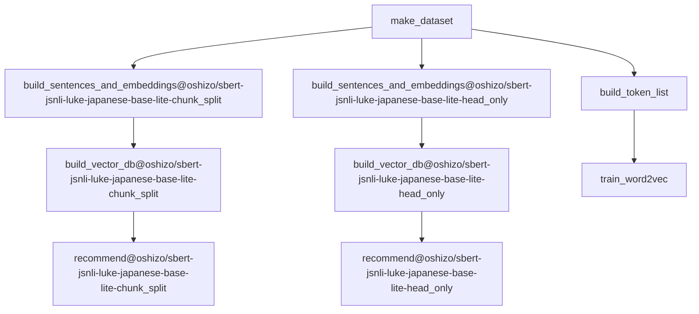

```mermaid
flowchart TD
	node1["build_sentences_and_embeddings@oshizo/sbert-jsnli-luke-japanese-base-lite-chunk_split"]
	node2["build_sentences_and_embeddings@oshizo/sbert-jsnli-luke-japanese-base-lite-head_only"]
	node3["build_token_list"]
	node4["build_vector_db@oshizo/sbert-jsnli-luke-japanese-base-lite-chunk_split"]
	node5["build_vector_db@oshizo/sbert-jsnli-luke-japanese-base-lite-head_only"]
	node6["make_dataset"]
	node7["recommend@oshizo/sbert-jsnli-luke-japanese-base-lite-chunk_split"]
	node8["recommend@oshizo/sbert-jsnli-luke-japanese-base-lite-head_only"]
	node9["train_word2vec"]
	node1-->node4
	node2-->node5
	node3-->node9
	node4-->node7
	node5-->node8
	node6-->node1
	node6-->node2
	node6-->node3
```
