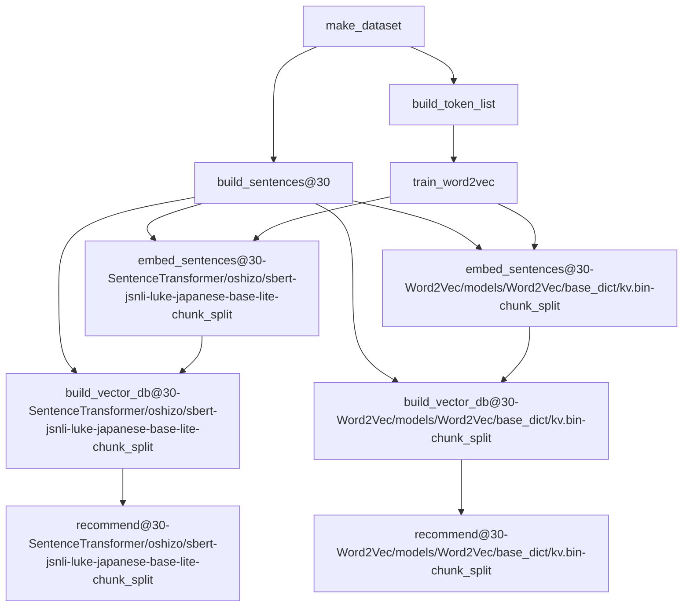

```mermaid
flowchart TD
	node1["build_sentences@30"]
	node2["build_token_list"]
	node3["build_vector_db@30-SentenceTransformer/oshizo/sbert-jsnli-luke-japanese-base-lite-chunk_split"]
	node4["build_vector_db@30-Word2Vec/models/Word2Vec/base_dict/kv.bin-chunk_split"]
	node5["embed_sentences@30-SentenceTransformer/oshizo/sbert-jsnli-luke-japanese-base-lite-chunk_split"]
	node6["embed_sentences@30-Word2Vec/models/Word2Vec/base_dict/kv.bin-chunk_split"]
	node7["make_dataset"]
	node8["recommend@30-SentenceTransformer/oshizo/sbert-jsnli-luke-japanese-base-lite-chunk_split"]
	node9["recommend@30-Word2Vec/models/Word2Vec/base_dict/kv.bin-chunk_split"]
	node10["train_word2vec"]
	node1-->node3
	node1-->node4
	node1-->node5
	node1-->node6
	node2-->node10
	node3-->node8
	node4-->node9
	node5-->node3
	node6-->node4
	node7-->node1
	node7-->node2
	node10-->node5
	node10-->node6
```
